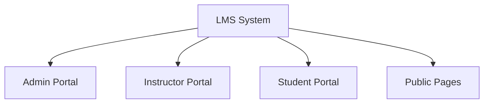
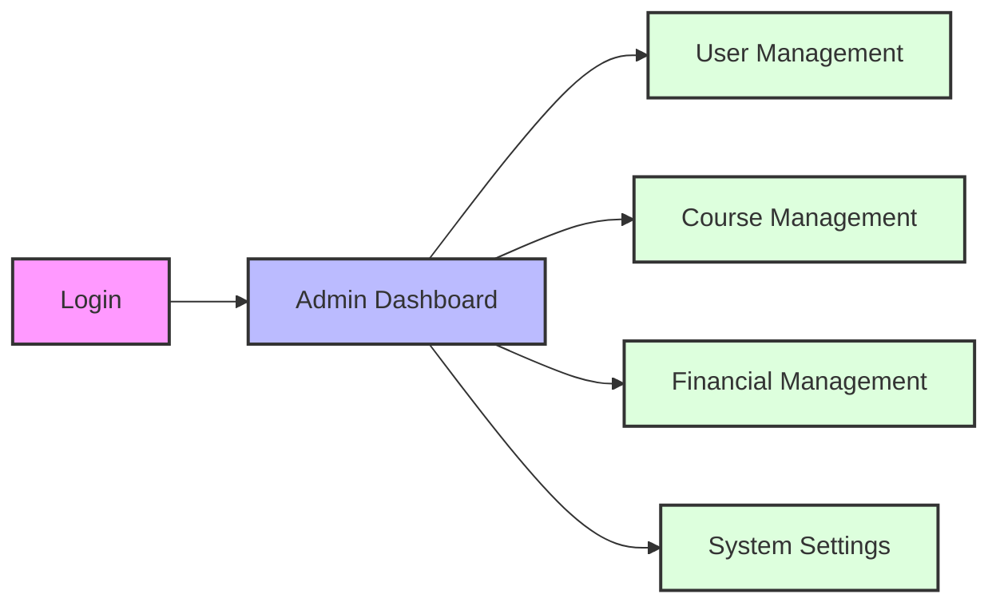
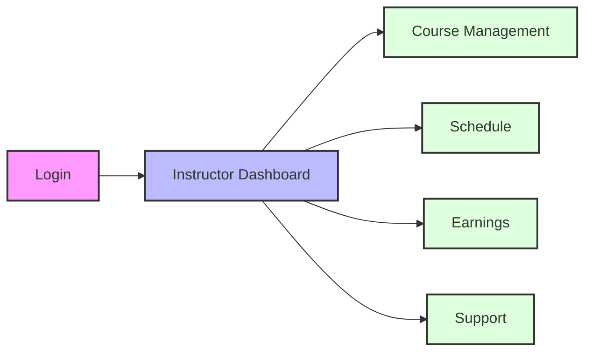
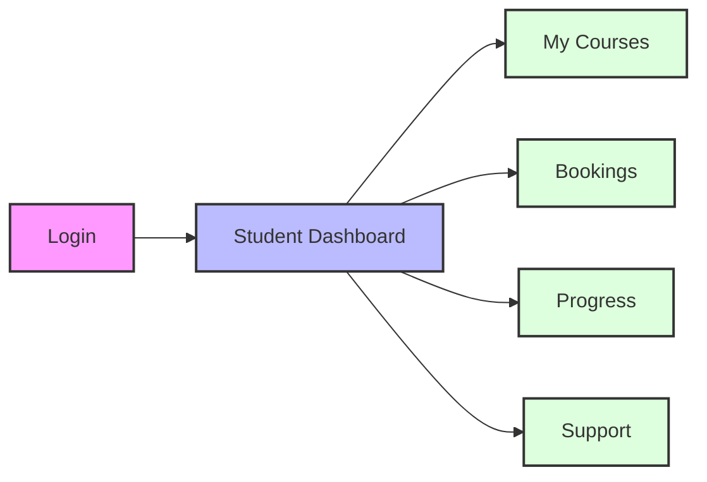

# LMS Frontend Documentation

## Table of Contents
- [System Overview](#system-overview)
- [Technical Architecture](#technical-architecture)
- [Role-Based Features](#role-based-features)
  - [Admin Role](#admin-role)
  - [Instructor Role](#instructor-role)
  - [Student Role](#student-role)
- [Common Features](#common-features)
- [Integration Points](#integration-points)

## System Overview

The LMS (Learning Management System) frontend is built using Next.js, providing a modern and responsive interface for managing online education. The system supports three main user roles:



### Key Technologies
- **Framework**: Next.js 14.2.3
- **State Management**: Redux Toolkit with createAsyncThunk
- **UI Components**: React 19.0.0
- **Styling**: TailwindCSS with custom utilities
- **Forms**: React Hook Form for validation
- **Charts**: Chart.js with react-chartjs-2
- **Payments**: Stripe Integration for secure transactions
- **Data Fetching**: Axios with custom API instance
- **Date Handling**: date-fns and dateformat
- **Date Management**: date-fns

## Technical Architecture

### Core Components
1. **Pages Structure**
   - Role-based dashboard pages
   - Public pages (courses, tutors, etc.)
   - Authentication pages

2. **State Management**
   - Redux store for global state management
   - Feature-based slice architecture:
     ```javascript
     // Example Course Slice Structure
     {
       courses: {
         enrolledCourses: [],
         categories: [],
         courses: [],
         totalPages: null,
         courseData: {},
         perchasedCourse: null,
         orders: [],
         isLoading: {},
         error: {}
       }
     }
     ```
   - Async actions using CreateApiAsyncThunk
   - Loading and error states for each operation
   - Normalized state structure for efficient updates

3. **Layouts**
   - Role-specific dashboard layouts
   - Public page layouts
   - Reusable components

## Role-Based Features

### Admin Role

#### Dashboard
- Statistics cards showing key metrics
- Earnings summary and charts
- Booking management
- Support ticket overview
- Schedule view

#### Features
1. **User Management**
   - Manage students
   - Manage instructors
   - User approvals
   - Manage Profile

2. **Course Management**
   - Course Workflow:

     ```mermaid
     stateDiagram-v2
       [*] --> Draft
       Draft --> UnderReview: Submit
       UnderReview --> Published: Approve
       UnderReview --> Draft: Request Changes
       Published --> Unpublished: Disable
       Unpublished --> Published: Enable
       Published --> [*]
     ```

   - Course Approval System:
     - Content review
     - Quality standards verification
     - Instructor credentials check
     - Pricing approval
   
   - Category Management:
     - Hierarchical category system
     - Dynamic category creation
     - Category-based course filtering
     - SEO-optimized slugs
   
   - Content Organization:
     - Module-based structure
     - Progress tracking
     - Certificate generation
     - Completion status monitoring

3. **Financial Management**
   - Sales tracking
   - Withdrawal approvals
   - Payment management
   - Revenue analytics

4. **System Configuration**
   - Language settings
   - Platform settings
   - Support management

### Instructor Role

#### Dashboard
- Course statistics
- Earnings overview
- Booking calendar
- Support tickets

#### Features
1. **Course Management**
    - Course Creation and Management:
      ```javascript
      // Course Structure
      {
        title: String,
        description: String,
        category: ObjectId,
        subCategory: ObjectId,
        price: Number,
        modules: [{
          title: String,
          content: String,
          resources: Array,
          isCompleted: Boolean
        }],
        status: enum['draft', 'under-review', 'published'],
        ratings: Array,
        enrollments: Number
      }
      ```
    - Content Management Features:
      - Rich text editor support
      - Resource attachment system
      - Video content integration
      - Interactive elements
    
    - Progress Tracking System:
      - Module completion tracking
      - Assessment management
      - Performance analytics
      - Student engagement metrics

2. **Schedule Management**
   - Booking calendar
   - Availability settings
   - Class scheduling

3. **Financial**
   - Earnings tracking
   - Withdrawal requests
   - Payment history
   - Wallet management

### Student Role

#### Dashboard
- Enrolled courses
- Upcoming classes
- Learning progress
- Bookings overview

#### Features
1. **Learning Management**
    - Course Enrollment Process:

      ```mermaid
      graph TD
        A[Browse Course] --> B[View Details]
        B --> C[Purchase/Enroll]
        C --> D[Payment Processing]
        D --> E[Course Access]
        E --> F[Module Access]
        F --> G[Track Progress]
        G --> H[Complete Course]
        H --> I[Get Certificate]
      ```

    
    - Learning Features:
      - Interactive course content
      - Progress checkpoints
      - Resource downloads
      - Module-wise completion
    
    - Assessment System:
      - Quiz management
      - Assignment submissions
      - Performance tracking
      - Certification criteria
    
    - Review System:
      - Course ratings
      - Detailed reviews
      - Instructor feedback
      - Rating analytics

2. **Booking Management**
   - Class bookings
   - Schedule viewing
   - Payment processing
   - Booking history

3. **Support**
   - Q&A section
   - Support tickets
   - Course reviews
   - Wishlist management

## Common Features

### Authentication
- Email-based registration
- Login verification
- Password reset
- Email verification

### Profile Management
- Personal information
- Manage Profile
- Notification preferences
- Security settings

### Support System
- Ticket creation
- Status tracking
- Communication thread
- File attachments

## Integration Points
### Payment Processing

#### Primary Payment Gateway - PayFast
- Dedicated implementations for courses and bookings:
  - `PayfastCheckoutForCourse` - Handles course purchases
  - `PayfastCheckoutForBooking` - Handles session bookings

- Payment Flow:
  ```mermaid
  sequenceDiagram
    participant User
    participant Frontend
    participant PayFast
    participant Backend

    User->>Frontend: Initiate Payment
    Frontend->>Backend: Create Payment Session
    Backend->>PayFast: Generate Payment URL
    PayFast-->>Frontend: Payment URL
    Note over Frontend: Open PayFast Window
    loop Payment Verification
        Frontend->>Backend: Poll Payment Status
        Backend->>PayFast: Verify Payment
        PayFast-->>Backend: Payment Status
        Backend-->>Frontend: Status Update
    end
    Note over Frontend: Close PayFast Window
    Frontend->>Backend: Create Order/Booking
    Backend-->>Frontend: Success Response
  ```


- Features:
  1. Course Payments:
     - Popup window for PayFast checkout
     - Automatic payment verification
     - Course access upon successful payment
     - Order creation and confirmation
     - Payment status tracking

  2. Booking Payments:
     - Real-time payment verification
     - Session booking confirmation
     - Detailed booking information display
     - Automatic redirect to bookings page
     - Payment status monitoring

- Implementation Features:
  ```javascript
  // Payment Status Handling
  {
    paymentStatus: "paid" | "pending" | "failed",
    transactionId: String,
    amount: Number,
    metadata: {
      courseId?: String,
      sessionId?: String,
      bookingId?: String
    }
  }
  ```

#### Secondary Payment Gateway - Stripe
- Alternative payment option
- International payment support
- Standard Stripe checkout flow
- Used as backup payment method

#### Common Features
- Secure payment processing
- Transaction history
- Payment verification system
- Error handling and recovery
- Session management
- Transaction history with detailed logging

### Email System
- Verification emails
- Password reset
- Notifications
- Course updates

### File Storage
- Course materials
- Profile images
- Support attachments
- System resources

### Analytics
- User engagement metrics
- Course performance
- Financial reports
- System usage statistics

## Navigation Flows

### Admin Flow



### Instructor Flow



### Student Flow



## Security Considerations

1. **Authentication**
   - JWT-based authentication
   - Role-based access control
   - Session management

2. **Data Protection**
   - Secure form handling
   - Input validation
   - XSS protection

3. **Payment Security**
   - Stripe secure integration
   - PCI compliance
   - Transaction encryption

## Performance Optimizations

1. **Code Splitting**
   - Dynamic imports
   - Route-based code splitting
   - Lazy loading

2. **State Management**
   - Efficient Redux usage
   - Local state optimization
   - Caching strategies

3. **Resource Loading**
   - Image optimization
   - CDN integration
   - Asset minification